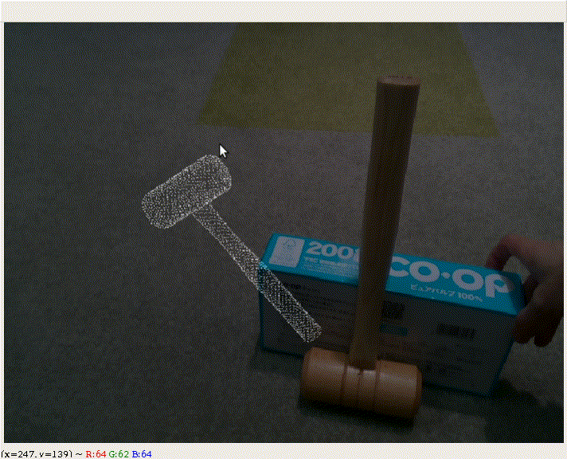
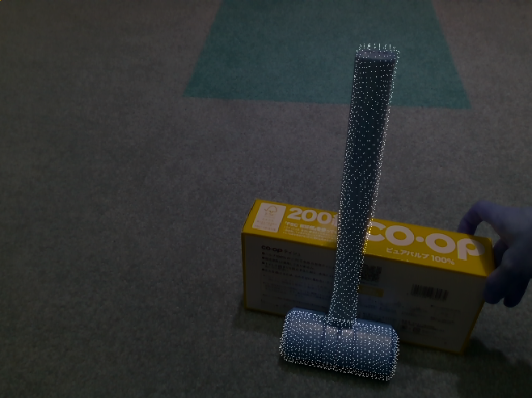

# 6DPoseAnnotator

An interactive 6 degree-of-freedom pose annotation tool using point cloud processings.



## Requirements
- Numpy
- [Open3D](http://www.open3d.org/)
- [OpenCV](https://opencv.org/)

## 6D pose annotation with mouse and keyboard commands

Type:
```
$ python 6DoFPoseAnnotator.py
```

You can use following commands: 

- Left click - Translation to the mouse pointer
- "1" - Rotation around roll axis.
- "2" - Rotation around pitch axis.
- "3" - Rotation around yaw axis.
- "i" - Pose refinement by ICP algorithm (Coarse mode).
- "f" - Pose refinement by ICP algorithm (Fine mode).
- "q" - Quit



When you type "q", a final transformation matrix, "trans.json", and a transformed point cloud, "cloud_rot.ply", are saved.

### Starting from specific initial transformation
By using option "--init", you can choose initial transformation matrix to be apply.

Try:
```
$ python 6DoFPoseAnnotator.py --init data/trans.json
```


## Visualization by 3D viewer

For visualizing results in 3D space, type:
```
$ python pv.py --input cloud_in_ds.ply cloud_rot.ply
```


## How to get RGB and depth image?
I strongly recommend to follow [pyrs](https://github.com/Toraudonn/pyrs) repository.
Images of directory "data/" were captured using that repository.

## ToDo

- [x] output a total transformation matrix
- [x] add input arguments (model name, scene name)
- [x] add input argument of initial pose
- [ ] handle depth lack points 
- [ ] visualize depth data of input scene
- [ ] visualize coordinate axis